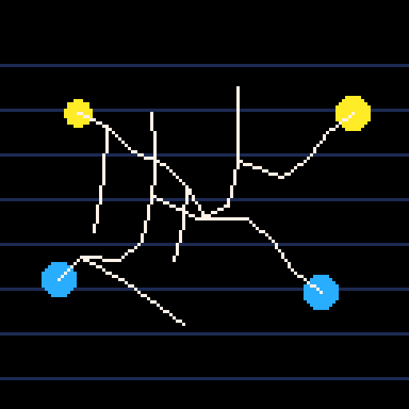

# Electric arcs

`electricity` draws short, irregular lightning bolts between two points. Each strike keeps its endpoints fixed while a seeded generator creates a jagged main path and optional side branches. Repeated strikes produce different bolt geometry without changing the game's global random generator.



## Support status

| Engine | Source | Include method | Status |
| --- | --- | --- | --- |
| PICO-8 | `src/pico8/electricity.lua` | `#include` | Standalone showcase and API contract carts boot; verify token and CPU cost in the host cartridge |
| Picotron | `src/picotron/electricity.lua` | `include()` | Headless smoke and five-run benchmark cover all profiles; see the [Picotron report](../../benchmarks/results/picotron-effects.md) |
| LÖVE | `src/love2d/electricity.lua` | `require()` | Bounded line rendering, native API tests, and five-run benchmark cover all profiles; see the [LÖVE report](../../benchmarks/results/love2d-effects-latest.md) |
| TIC-80 | `src/tic80/electricity.lua` | Build-time include expansion | User confirms visual checks and performance measurements are complete; detailed results are not yet recorded in the benchmark report |

## Integration

Create one arc system during game setup, call `strike()` when an event occurs, update it once per game tick, and draw after the scene. Fantasy console `dt` is `1 / 60`; LÖVE uses seconds from `love.update`.

```lua
-- LÖVE
local electricity = require("vfx8.electricity").new({quality = "medium"})

local function connect_targets(source, target)
  electricity:strike(source.x, source.y, target.x, target.y, {
    branches = 2,
    branch_probability = 0.7,
    branch_angle = 1.05,
    branch_length = 0.28,
    bolt_count = 2,
    jaggedness = 6,
    life = 0.16,
    width = 2,
    color = {0.2, 0.7, 1.0},
    core_color = {0.9, 0.98, 1.0},
    flicker = true
  })
end

function on_hit(source, target)
  connect_targets(source, target)
end

function love.update(dt)
  update_game(dt)
  electricity:update(dt)
end

function love.draw()
  draw_game_scene()
  electricity:draw()
end
```

For PICO-8, include the module and call it from the cartridge's existing callbacks:

```lua
#include "vfx8/electricity.lua"
local arcs = vfx8_electricity.new({quality = "medium"})
function _update60()
  if btnp(4) then arcs:strike(12, 20, 116, 42) end
  arcs:update(1 / 60)
end
function _draw()
  cls()
  arcs:draw()
end
```

Picotron uses its cartridge `include()` and update/draw callbacks:

```lua
include("vfx8/electricity.lua")
local arcs = vfx8_electricity.new({quality = "medium"})
function _update()
  if btnp(4) then arcs:strike(24, 32, 216, 72) end
  arcs:update(1 / 60)
end
function _draw()
  cls()
  arcs:draw()
end
```

For TIC-80, expand `--#include` before importing the cartridge and call the methods from `TIC()`:

```lua
--#include "vfx8/electricity.lua"
local arcs = vfx8_electricity.new({quality = "medium"})
function TIC()
  cls()
  if btnp(4) then arcs:strike(24, 32, 216, 72) end
  arcs:update(1 / 60)
  arcs:draw()
end
```

## API

### `new(options)`

Creates a fixed-capacity system. `quality` accepts `"low"`, `"medium"`, or `"high"`. Optional `capacity`, `max_emit`, and `seed` tune the segment pool, per-update segment budget, and deterministic random sequence. Engine hard caps always apply.

### `strike(x1, y1, x2, y2, options)`

Creates a polyline from the exact start point to the exact end point and returns the number of segments admitted by the budget. A zero-length strike returns zero. Optional fields:

| Option | Default | Meaning |
| --- | --- | --- |
| `segments` | Profile dependent | Main path subdivisions, clamped to 2–24 |
| `branches` | Profile dependent | Side forks, clamped to 0–8 |
| `branch_probability` | `1` | Chance from 0 to 1 of drawing each requested fork |
| `branch_angle` | Existing geometry (~1.068 radians) | Fork angle relative to the parent path |
| `branch_length` | Existing randomized 16–32% of bolt length | Fork reach as a fraction of the main bolt |
| `jaggedness` | Up to 16% of bolt length | Maximum lateral displacement from the direct path |
| `life` | `0.14` seconds | Segment lifetime, clamped to at least `0.025` seconds |
| `width` | `1` at low, `2` otherwise | LÖVE line width; consoles draw with native one-pixel lines |
| `color` | Engine default | RGB table in LÖVE; palette index on fantasy consoles |
| `core_color` | `color` or engine default | Bright inner line in LÖVE; selected palette color on consoles |
| `flicker` | `false` | LÖVE dims stored segments periodically; consoles approximate flicker with a palette step |
| `pulse_count` | `0` | Optional brightness pulses; consoles quantize them to palette steps |
| `bolt_count` | `1` | Parallel bolts, clamped to 1–8 and constrained by the pool and emission budget |

Set `branches = 0` and a small `jaggedness` for a clean arc, or raise both for a branching, violent bolt. Segment generation runs only when `strike()` is called.

### `update(dt)`, `draw()`, `clear()`, and `stats()`

`update(dt)` advances segment lifetimes and removes expired segments by swapping with the last active segment. `draw()` renders an electric-blue outer line and a bright core in LÖVE; palette consoles use native one-pixel lines and approximate custom colors/flicker/pulses with indexed palette steps. LÖVE colors are normalized components in the 0–1 range. Fantasy consoles accept native palette indices, not RGB tuples. `width` remains accepted on consoles but rasterizes at one pixel because their portable line primitives do not expose line-width control. `seed` controls repeatable geometry without changing the host game's random generator. LÖVE restores its incoming line width and draw color. `clear()` removes active segments. `stats()` returns active segments, pool capacity, and segments emitted in the previous update.

## Quality and budgets

| Engine | Low segments / branches / pool / update cap | Medium | High |
| --- | ---: | ---: | ---: |
| PICO-8 | 5 / 1 / 32 / 16 | 7 / 1 / 64 / 24 | 9 / 2 / 96 / 32 |
| Picotron | 6 / 1 / 64 / 32 | 9 / 2 / 128 / 48 | 12 / 3 / 224 / 64 |
| LÖVE | 7 / 1 / 96 / 64 | 11 / 2 / 192 / 128 | 15 / 3 / 320 / 192 |
| TIC-80 | 5 / 1 / 32 / 16 | 7 / 1 / 64 / 24 | 10 / 2 / 112 / 32 |

Each table entry lists main path segments, side branches, pool capacity, and maximum new segments per update. Each emitted line occupies one pool entry. The pool and `max_emit` cap work even if many strikes are requested before the next `update()`. When full, later segments are dropped; existing arcs are not evicted. The pools and scratch-vertex arrays are allocated once in `new()`; drawing and updating allocate no segment tables.
