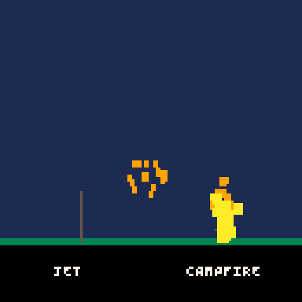

# Flame simulation

`flames` provides two compact, pixel-based fire effects: a directional flamethrower jet and a continuously emitted campfire plume. Each engine has its own implementation and fixed particle budget; neither mode installs or replaces game callbacks.



## Support status

| Engine | Source | Include method | Verification |
| --- | --- | --- | --- |
| PICO-8 | `src/pico8/flames.lua` | `#include` | User confirms visual checks and performance measurements are complete; standalone module token count remains open |
| Picotron | `src/picotron/flames.lua` | `include()` | User confirms visual checks are complete; headless runtime smoke and five-run benchmark cover all profiles. See the [Picotron report](../../benchmarks/results/picotron-effects.md) |
| LÖVE | `src/love2d/flames.lua` | `require()` | User confirms visual checks are complete; native API tests and five-run benchmark cover all profiles. See the [LÖVE report](../../benchmarks/results/love2d-effects-latest.md) |
| TIC-80 | `src/tic80/flames.lua` | Build-time include expansion | User confirms visual checks and performance measurements are complete; detailed results are not yet recorded in the benchmark report |

## Integration

Include only the engine-specific module. Call `update(dt)` once each update and `draw()` after the scene. Fantasy console demos pass `1 / 60`; LÖVE uses the `dt` supplied by `love.update`.

```lua
-- LÖVE
local flames = require("vfx8.flames").new({quality = "medium"})

-- In the enemy defeat handler, aim the jet away from the enemy center.
flames:emit_jet(enemy.x, enemy.y, 1, -0.15, {count = 24})

-- Or place a campfire and keep it burning by emitting during update.
local fire_x, fire_y = 120, 100
function love.update(dt)
  flames:emit_campfire(fire_x, fire_y)
  flames:update(dt)
end

function love.draw()
  draw_game_scene()
  flames:draw()
end
```

For PICO-8, Picotron, and TIC-80, construct `vfx8_flames.new({quality = "medium"})` after including the module. Put calls to `emit_jet` or `emit_campfire` in the game's own event and update functions, and call `flames:update(1 / 60)` and `flames:draw()` from the existing loop.

## API

### `new(options)`

Creates an independent fire system. `options.quality` accepts `"low"`, `"medium"`, or `"high"`. Each profile sets a bounded pool capacity and maximum emissions per update. `options.capacity`, `options.max_emit`, and `options.seed` can tune the limits and deterministic random sequence; hard engine limits still apply.

### `emit_jet(x, y, dx, dy, options)`

Emits a directional stream from `(x, y)`. `(dx, dy)` defines the direction and is normalized internally; a zero vector emits nothing. Every option is optional; omitting it preserves the existing preset output.

### `emit_campfire(x, y, options)`

Emits a plume upward from a base centered at `(x, y)`. Repeating the call during each game update sustains the fire. `emission_rate` is an alias for `count` and means particles emitted per call (so call once each update for the expected frame rate).

| Option | Flamethrower | Campfire | Meaning |
| --- | --- | --- | --- |
| `count` / `emission_rate` | Yes | Yes | Requested particles per call, limited by profile and remaining pool budget. |
| `speed` | Yes | Yes | Existing velocity magnitude in pixels/second. |
| `distance` | Yes | — | Target jet travel distance in pixels. Sets speed to `distance / life`; explicit `speed` is superseded when `distance` is present. |
| `height` | — | Yes | Target plume travel height in pixels. Sets upward speed to `height / life`; explicit `speed` is superseded when `height` is present. |
| `width` | Yes | — | Full nozzle width in pixels; particles spawn across half-width on either side of the jet origin. |
| `spread` | Yes | Yes | Existing lateral velocity spread for the jet or base width fallback. |
| `radius` / `base_radius` | — | Yes | Campfire base half-width in pixels; `base_radius` takes precedence. `radius` remains accepted for compatibility. |
| `life` | Yes | Yes | Particle lifetime in seconds, minimum `0.05`. |
| `gravity`, `drag` | Yes | Yes | Acceleration in pixels/second² and linear velocity loss per second. Positive gravity points down. |
| `wind` | Yes | Yes | Constant acceleration `{x, y}` in pixels/second²; array form `{x, y}` is also accepted. |
| `size`, `end_size` | Yes | Yes | Initial and final particle size in pixels. If `end_size` is omitted, the old shrink-to-18%-of-start behavior is preserved. |
| `flicker` | Yes | Yes | Scales per-particle size variation; default `1` preserves current randomized size variation, `0` disables it. |
| `flicker_speed` | Yes | Yes | Animated flicker frequency in cycles/second. Defaults to `0`, preserving the current non-animated variation. |
| `colors` | Yes | Yes | Four age-ramp colors. Fantasy consoles use palette indices; LÖVE uses four normalized RGB triplets (`{r, g, b}` with values from 0 to 1). |

For the jet, `width` affects origin placement and `spread` affects the cone's sideways velocity. For the campfire, `base_radius` or `radius` sets base width; if neither is supplied, the previous `spread`-based width is retained. `distance` and `height` are convenient target travel controls, not collision distances: particles remain individual particles and can drift under gravity, drag, and wind. Values are clamped by existing capacity/emission limits; requested particles are dropped when a budget is full.

```lua
flames:emit_jet(player.x, player.y, aim_x, aim_y, {
  count = 18,
  speed = 92,
  spread = 0.18,
  life = 0.38
})
```

On PICO-8, Picotron, and TIC-80 the particles are palette-index squares. LÖVE draws the same pixel plume with filled rectangles. These renderers do not rotate the flame particles; their geometry remains square/rectangular. Options whose behavior differs by engine are spelled out above so callers can select the appropriate color representation.

```lua
flames:emit_campfire(fire.x, fire.y, {base_radius = 6, emission_rate = 3, height = 38})
```

### `update(dt)`, `draw()`, `clear()`, and `stats()`

`update(dt)` advances motion in seconds and resets the per-update emission budget. `draw()` draws square pixels using an age-based yellow, orange, and red ramp, shrinking each particle toward the end of its life. `clear()` removes all active particles. `stats()` returns active count, pool capacity, and particles emitted in the most recent update.

## Quality profiles and limits

| Engine | Low capacity / update cap | Medium | High | Hard capacity ceiling |
| --- | ---: | ---: | ---: | ---: |
| PICO-8 | 24 / 8 | 40 / 12 | 56 / 16 | 64 |
| Picotron | 48 / 16 | 96 / 32 | 160 / 48 | 256 |
| LÖVE | 128 / 32 | 256 / 64 | 512 / 128 | 512 |
| TIC-80 | 24 / 8 | 48 / 16 | 80 / 24 | 128 |

The first value is the default active pool and the second is the maximum number accepted in one `update()` interval. Higher profiles increase visible density while respecting each engine's ceiling. If a pool or update budget is full, new particles are dropped; existing particles are never evicted. For a campfire, call `emit_campfire` each update and let the pool budget naturally cap the sustained plume.

PICO-8, Picotron, and TIC-80 draw palette-index pixels with engine primitives. LÖVE draws the same style with filled rectangles and restores the caller's color after drawing. Call `draw()` after the world and before UI that should appear above the fire.

### Enemy defeat integration

Call the effect from the game's own defeat handler, and retain ownership of the callbacks. The LÖVE example below uses RGB colors. The fantasy console examples use each engine's palette indices and existing callback style.

```lua
local flames = require("vfx8.flames").new({quality = "medium", seed = 11})

local function defeat_enemy(enemy)
  if enemy.dead then return end
  enemy.dead = true
  flames:emit_jet(enemy.x, enemy.y, 1, -0.12, {
    count = 20,
    distance = 54,
    width = 7,
    life = 0.42,
    spread = 0.18,
    colors = {
      {1.00, 0.96, 0.57},
      {1.00, 0.73, 0.16},
      {1.00, 0.34, 0.06},
      {0.68, 0.09, 0.025}
    }
  })
end

function love.update(dt)
  update_enemies(dt, defeat_enemy)
  flames:update(dt)
end

function love.draw()
  draw_world()
  flames:draw()
  draw_ui()
end
```

PICO-8:

```lua
#include vfx8/flames.lua
flames = vfx8_flames.new({quality = "low"})

function on_enemy_defeated(enemy)
  flames:emit_jet(enemy.x, enemy.y, 1, -0.12, {
    distance = 32, width = 5, colors = {7, 10, 9, 8}
  })
end

function _update60()
  update_game()
  flames:update(1 / 60)
end

function _draw()
  cls()
  draw_world()
  flames:draw()
  draw_ui()
end
```

Picotron:

```lua
include("vfx8/flames.lua")
flames = vfx8_flames.new({quality = "medium"})

function on_enemy_defeated(enemy)
  flames:emit_jet(enemy.x, enemy.y, 1, -0.12, {
    distance = 54, width = 7, colors = {7, 10, 9, 8}
  })
end

function _update()
  update_game()
  flames:update(1 / 60)
end

function _draw()
  draw_world()
  flames:draw()
  draw_ui()
end
```

TIC-80 (expand `--#include "vfx8/flames.lua"` with the include tool before importing the game code):

```lua
local flames = vfx8_flames.new({quality = "low"})

function on_enemy_defeated(enemy)
  flames:emit_jet(enemy.x, enemy.y, 1, -0.12, {
    distance = 32, width = 5, colors = {7, 10, 9, 8}
  })
end

function TIC()
  update_game()
  flames:update(1 / 60)
  cls(0)
  draw_world()
  flames:draw()
  draw_ui()
end
```

Picotron and LÖVE have repeatable all-profile typical and saturated measurements in the [Picotron](../../benchmarks/results/picotron-effects.md) and [LÖVE](../../benchmarks/results/love2d-effects-latest.md) reports. The user confirms PICO-8 and TIC-80 visual/performance checks are complete; their detailed values are not yet recorded. Standalone PICO-8 module token cost remains open.
