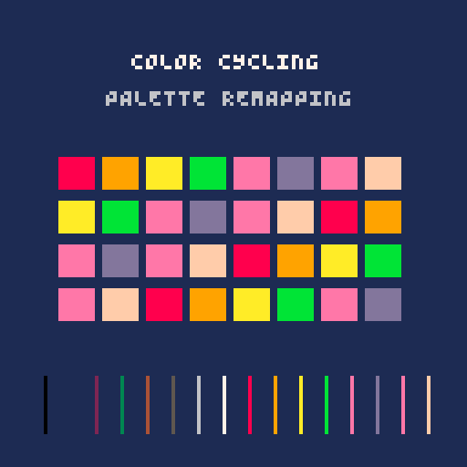

# Palette effects and color cycling

`palette_fx` maps palette indices for color cycling, local flashes, glow pulses, temporary palette negatives, and day/night, sepia, and monochrome filters. It does not change the engine's global palette or framebuffer. Apply `map_color()` to the color argument of draw calls that should receive an effect; leave UI and unrelated objects unmapped.



## Support and status

| Engine | Module | Integration | Status |
| --- | --- | --- | --- |
| PICO-8 | `src/pico8/palette_fx.lua` | `#include` | Native palette contract and profile carts pass; temporal cycle and pulse phases are cached during update |
| Picotron | `src/picotron/palette_fx.lua` | `include()` | User confirms visual checks are complete; headless runtime smoke and five-run helper-workload benchmark cover all profiles. See the [Picotron report](../../benchmarks/results/picotron-effects.md) |
| LÖVE | `src/love2d/palette_fx.lua` | `require()` | Native API tests and five-run helper-workload benchmark pass on LÖVE 11.5; see the [LÖVE report](../../benchmarks/results/love2d-effects-latest.md). Temporal cycle and pulse phases are cached during update |
| TIC-80 | `src/tic80/palette_fx.lua` | build-time include | User confirms visual checks and performance measurements are complete; detailed results are not yet recorded in the benchmark report |

The built-in filters are 16-entry index maps designed for a PICO-8-style palette. Picotron accepts up to 64 colors, but its built-in filters affect only indices 0 through 15. Use `set_filter_map()` for a custom palette layout or to map all 64 Picotron indices.

## Integration

Copy and load only the module for your engine. It does not define callbacks or change global palette state. In the following examples, create the instance once, advance it in the game's existing update callback, and map only the colors that should receive the effect.

### PICO-8

```lua
#include vfx8/palette_fx.lua
local palette = vfx8_palette_fx.new({quality = "low", color_count = 16})
palette:set_cycle(8, 11, 2)

function _update60()
  palette:update(1 / 60)
end

function draw_actor(x, y)
  rectfill(x, y, x + 7, y + 7, palette:map_color(8))
end
```

### Picotron

```lua
include("vfx8/palette_fx.lua")
local palette = vfx8_palette_fx.new({quality = "low", color_count = 16})

function _update()
  palette:update(1 / 60)
end

function draw_actor(x, y)
  rectfill(x, y, x + 7, y + 7, palette:map_color(8))
end
```

### LÖVE

```lua
local palette_fx = require("vfx8.palette_fx")
local palette = palette_fx.new({quality = "low", color_count = 16})

function love.update(dt)
  palette:update(dt)
end

function draw_actor(x, y, rgb_palette)
  local index = palette:map_color(8)
  love.graphics.setColor(rgb_palette[index + 1])
  love.graphics.rectangle("fill", x, y, 8, 8)
end
```

### TIC-80

```lua
--#include "vfx8/palette_fx.lua"
local palette = vfx8_palette_fx.new({quality = "low", color_count = 16})

function TIC()
  palette:update(1 / 60)
  rect(20, 20, 8, 8, palette:map_color(8))
end
```

```lua
local palette = vfx8_palette_fx.new({quality = "low", color_count = 16})
palette:set_cycle(8, 11, 2)

function update_game(dt)
  palette:update(dt)
end

function draw_actor(x, y, color_index)
  rectfill(x, y, x + 7, y + 7, palette:map_color(color_index))
end
```

For LÖVE, use the returned index to select the corresponding RGB value from your game's palette table before calling `love.graphics.setColor()`. `map_color()` accepts an integer palette index, not an RGB triplet.

## API

```lua
local palette = vfx8_palette_fx.new({quality = "low", color_count = 16})
palette:set_cycle(8, 11, 2)       -- Rotate indices 8..11 twice per second.
palette:set_filter("night")      -- Or "sepia" or "mono".
palette:set_pulse(8, 10, 4)       -- Alternate two indices four times per second.
palette:flash(8, 11, 7, 0.18)    -- Map the selected range to index 7 temporarily.
palette:set_invert_palette(rgb_palette) -- Configure RGB colors in index order, components 0..1.
palette:invert(0.18)             -- Apply the nearest-color negative map temporarily.
local color = palette:map_color(index)
palette:update(dt)
palette:clear()
```

- `set_cycle(first, last, rate)` rotates an inclusive index range. `rate` is complete range rotations per second. It returns `false` for invalid ranges.
- `clear_cycle()` disables cycling.
- `set_filter(name)` selects `night`, `sepia`, or `mono` and returns `false` for an unknown name. `clear_filter()` disables it.
- `set_filter_map(map)` copies a custom index map after validating one integer target per configured color. Targets must be within `0..color_count-1`. Invalid maps return `false` and leave the active filter unchanged. Extra entries are ignored.
- `set_pulse(first, second, frequency)` alternates between two indices. A non-positive frequency disables the pulse.
- `flash(first, last, target, duration)` temporarily maps an inclusive input range to one index. Apply it only to the object that needs feedback.
- `set_invert_palette(rgb_palette)` accepts an RGB triple per configured index, with components in the 0..1 range, and builds a nearest-color negative lookup once. It returns `false` if the palette is incomplete or malformed.
- `invert(duration)` temporarily applies that lookup and returns `false` until a valid RGB palette has been configured. `clear_invert()` ends it immediately.
- `map_color(index)` composes effects in this order: cycle, filter, pulse, temporary inversion, then flash. Indices outside the configured color range pass through unchanged.
- `set_priority(order)` changes that composition order. Supply each of `cycle`, `filter`, `pulse`, `invert`, and `flash` exactly once; invalid orders return `false` without changing the active order.
- `update(dt)` advances timers, clamps `dt` to 0..0.1 seconds, and allocates no tables. `clear()` resets the instance to its neutral mapping.

For a four-color palette, a custom map can be configured like this:

```lua
local small_palette = vfx8_palette_fx.new({color_count = 4})
small_palette:set_filter_map({0, 1, 1, 2})

local rgb_palette = {{0, 0, 0}, {1, 1, 1}, {1, 0, 0}, {0, 1, 1}}
small_palette:set_invert_palette(rgb_palette)
small_palette:invert(0.18)
```

## Demo controls

Select `palette_fx` with the module controls. Trigger flashes the actor's mapped colors; in the negative-flash variant it applies a temporary palette negative. The variant control cycles through color cycling, night, sepia, monochrome, glow pulse, a custom dusk map, and negative flash. The demo maps scene draw colors while leaving the HUD unchanged.

## Quality, cost, and limits

Mapping uses constant-time arithmetic and at most two table lookups per draw color. Cycle shifts and pulse phases are calculated in `update()` and reused by each mapping call. One PICO-8 stress-cart run with 128 mappings per frame recorded an average CPU fraction of `0.1076` before and `0.1056` after caching over 600 frames. This is a small whole-workload improvement, not a universal speedup guarantee; repeated timer and phase calculations have been removed from the per-color path. The module does not scan pixels, copy a framebuffer, or allocate memory while updating or mapping colors. Negative-map construction compares each configured RGB pair once (at most 64×64 comparisons on Picotron), not per frame. `color_count` is clamped to 16 on PICO-8, TIC-80, and LÖVE; Picotron supports 1..64 indices. Quality profiles do not change the fixed per-call cost. The Picotron and LÖVE reports measure repeatable helper-call workloads at all profiles: [Picotron](../../benchmarks/results/picotron-effects.md), [LÖVE](../../benchmarks/results/love2d-effects-latest.md). The user confirms PICO-8 and TIC-80 visual/performance checks are complete; their detailed values are not yet recorded.

Filters are direct index substitutions, not RGB color grading, so their output depends on the palette's index ordering. Built-in filters cover the first 16 indices; a custom map covers every configured index. Since this module avoids global palette changes, native sprite and tilemap calls that draw many indexed pixels are not intercepted; map their colors in the game renderer or draw path where feasible.

## State and interactions

The module owns only its instance state. It does not call `pal()`, `palt()`, alter LÖVE colors, or leave camera, clipping, or draw state changed. Apply `map_color()` only to scene elements that should participate. `flash()` affects mapped indices in its selected range; whole-screen flashes belong to `screen_fx`.

## Configurable parameters

Existing behavior remains the default: cycle direction `1` and phase `0`, pulse duty `0.5`, full flash intensity with a single target color, immediate palette filters, RGB-nearest inversion, and the effect priority `cycle → filter → pulse → invert → flash`.

```lua
local palette = vfx8_palette_fx.new({quality = "low", color_count = 16})
palette:set_cycle(8, 11, 2, -1, 0.25) -- range, rotations/second, direction, phase
palette:set_pulse(8, 10, 3, 0.1, 0.35) -- palette indices, cycles/second, phase, B-color duty
palette:set_filter("night", 0.4) -- transition time in seconds
palette:set_filter_map({0, 1, 1, 3, 4, 5, 6, 7, 8, 9, 10, 11, 12, 13, 14, 15}, 0.25)
palette:flash(8, 11, 7, 0.2, 0.5, {7, 10, 9}, 12) -- range, target, duration, coverage, target sequence, steps/second
palette:set_invert_palette(rgb_palette, "luminance") -- also supports "rgb" or "reverse"
palette:invert(0.18)
palette:set_priority({"cycle", "pulse", "filter", "invert", "flash"})
```

`set_cycle(first, last, rate, direction, phase)` rotates the inclusive range. Direction must be `1` or `-1`; phase is measured in range-rotation cycles. `set_pulse(first, second, frequency, phase, amount)` uses two palette indices and makes the second index visible for `amount` of each cycle (0..1); the default 0.5 matches the original alternating pulse. `flash(first, last, target, duration, intensity, sequence, sequence_rate)` limits coverage to the first `intensity` fraction of the selected input range. An optional sequence of valid palette indices replaces the single target and advances at `sequence_rate` steps per second. Invalid sequences return `false`. These are indexed-color operations: intensity selects coverage; it does not blend colors.

`set_filter(name, transition_duration)` and `set_filter_map(map, transition_duration)` can transition between maps. Because an indexed palette cannot represent a continuous blend without RGB palette access, this helper interpolates target index numbers and rounds to a valid index. For perceptually smooth color grading, animate the actual palette colors in the game renderer. `set_invert_palette(rgb_palette, matching)` precomputes a negative lookup using nearest RGB complement (`rgb`, default), nearest complementary luminance (`luminance`), or reversed index order (`reverse`). RGB and luminance matching require one normalized RGB triple per configured color. `invert(duration)` still applies the lookup temporarily.

The `priority` constructor setting is not required; configure priority with `set_priority()` so invalid lists can be reported. The default mapping is unchanged. All engines support index remapping. PICO-8 and TIC-80 have 16 configurable indices; Picotron supports up to 64, although built-in night/sepia/mono maps still define only the first 16 entries. LÖVE maps indices through the game's RGB palette table and cannot infer index colors from arbitrary RGB draw calls. No module changes engine-global palette registers; apply `map_color()` to colors in your own draw calls.

### External-project example

Copy only the engine-specific `palette_fx.lua` into the external game's `vfx8/` folder. The game keeps its callbacks and maps only the desired actor colors:

```lua
-- PICO-8: add #include vfx8/palette_fx.lua to the cart.
local palette = vfx8_palette_fx.new({color_count = 16})
palette:set_cycle(8, 11, 1.5, 1, 0)

function update_game()
  palette:update(1 / 60)
end

function draw_enemy(x, y)
  rectfill(x, y, x + 7, y + 7, palette:map_color(8))
end
```

Picotron uses `include("vfx8/palette_fx.lua")`; TIC-80 uses `--#include "vfx8/palette_fx.lua"` during its code build; LÖVE loads `require("vfx8.palette_fx")` and uses the mapped index to choose an entry from its RGB palette before calling `love.graphics.setColor()`. Avoid mapping HUD/UI colors unless they should share the effect.
