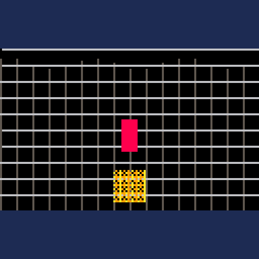

# Pixel deformation and animation

`pixel_deform` provides small coordinate and visibility helpers for water/flag waves, squash and stretch, and deterministic pixel dissolve masks. It does not copy or rewrite sprite sheets or framebuffers: apply its returned offsets, scales, and per-pixel visibility decisions while drawing your own object.



## Support and status

| Engine | Module | Integration | Runtime status |
| --- | --- | --- | --- |
| PICO-8 | `src/pico8/pixel_deform.lua` | `#include` | Native profile cart records helper-only typical-load samples at low, medium, and high; it does not rasterize transformed game sprites |
| Picotron | `src/picotron/pixel_deform.lua` | `include()` | User confirms visual checks are complete; headless runtime smoke and five-run helper-workload benchmark cover all profiles. See the [Picotron report](../../benchmarks/results/picotron-effects.md) |
| LÖVE | `src/love2d/pixel_deform.lua` | `require()` | Wave/grid-rotation demo and five-run helper-workload benchmark verified on LÖVE 11.5; see the [LÖVE report](../../benchmarks/results/love2d-effects-latest.md) |
| TIC-80 | `src/tic80/pixel_deform.lua` | build-time include | User confirms visual checks and performance measurements are complete; detailed results are not yet recorded in the benchmark report |

Wave output is deterministic and uses the engine's sine implementation. Squash/stretch changes scale over one trigger duration and returns smoothly to `(1, 1)`. Dissolve uses a fixed 4×4 threshold matrix, with ordered, checker, and spiral variants. The demo caches one offset per four-pixel column and reuses it across grid rows to limit sine calls. It applies these helpers to a small sample object and grid; it does not establish a universal sprite drawing API.

## Integration

Copy the engine module to `vfx8/pixel_deform.lua`, include it once, and keep your game's callbacks and sprite drawing. The helper returns values; your own draw code applies them.

```lua
-- PICO-8, Picotron, or TIC-80 after including the engine module
local deform = vfx8_pixel_deform.new({quality = "low"})

function update_game(dt)
  deform:update(dt)
  if landed then deform:set_squash(1.25, 0.75, 0.2) end
end

function draw_plant(x, y, time)
  local wave_y = deform:wave_offset(x, time, 2, 24, 0.4)
  local scale_x, scale_y = deform:scale()
  -- Apply wave_y and scale_x/scale_y in this game's sprite renderer.
  spr(plant_sprite, x, y + wave_y)
end
```

For LÖVE, load `require("vfx8.pixel_deform")`; all helper method names and units are the same. LÖVE projects can apply `scale()` with a local `push`/`translate`/`scale`/`pop`, while fantasy console sprite APIs generally need the game to draw a scaled sprite or reconstruct it from pixels.

## API

```lua
local deform = vfx8_pixel_deform.new({quality = "medium", phase = 0})
local offset = deform:wave_offset(x, time, amplitude, wavelength, speed, phase)
deform:set_squash(horizontal_scale, vertical_scale, duration)
deform:set_rotation(center_x, center_y, angle_radians)
local rotated_x, rotated_y = deform:rotate_point(x, y)
local left, top, right, bottom = deform:rotation_bounds(view_left, view_top, view_right, view_bottom, margin)
deform:update(dt)
local scale_x, scale_y = deform:scale()
local keep_pixel = deform:visible(x, y, dissolve_amount, "ordered")
deform:clear()
```

`wave_offset` returns a vertical offset in pixels. `wavelength` is clamped to at least one pixel; `time` is in seconds; the optional phase is measured in wave cycles. If `time` is omitted, the object's accumulated phase is used. `set_squash` clamps each scale to at least 0.1; `scale()` returns neutral scales after the duration expires. `update(dt)` advances wave phase and the squash animation, clamping `dt` to 0..0.1 seconds.

`visible` returns a boolean for a pixel at integer coordinates. Amount is clamped to 0..1: zero keeps all pixels and one removes all pixels. Modes are `ordered` (default), `checker`, and `spiral`. The 4×4 matrix repeats in object/screen coordinates; keep coordinates stable if the dissolve pattern should not crawl while the sprite moves.

## Configurable parameters

All constructor options are optional. Omitting them preserves the original defaults: wave amplitude `2`, wavelength `16`, speed `1`, phase `0`, vertical axis, and forward direction; squash scales `1.25`/`0.75`, duration `0.2`, sine easing, zero overshoot, and centered anchors; dissolve amount `0`, ordered matrix, inward progress, seed `0`; and warp sample steps of `4`, `2`, and `1` for low, medium, and high quality respectively.

```lua
local deform = vfx8_pixel_deform.new({
  quality = "medium",
  amplitude = 2, wavelength = 24, speed = 0.4, wave_phase = 0,
  axis = "y", direction = 1,
  overshoot = 0, easing = "sine", anchor_x = 0.5, anchor_y = 1,
  amount = 0, mode = "ordered", dissolve_direction = "in", seed = 0,
  scroll_speed_x = 0, scroll_speed_y = 0, warp_amplitude = 2,
  warp_wavelength = 24, frequency = 0.4, warp_phase = 0,
  rotation = 0, center_x = 120, center_y = 68, sample_step = 2
})

deform:set_wave({amplitude = 3, wavelength = 20, speed = 0.8, phase = 0.25, axis = "x", direction = -1})
local offset, axis = deform:wave_offset(plant_x, game_time)
deform:set_squash(1.3, 0.7, 0.24, 0.08, "smooth", 0.5, 1)
local sx, sy, anchor_x, anchor_y = deform:scale()
deform:set_dissolve(0.6, "spiral", "in", 23)
local keep_pixel = deform:visible(sprite_x, sprite_y)
local source_x, source_y = deform:warp_point(screen_x, screen_y, game_time)
```

`set_wave()` accepts an options table and returns `false` for a non-table value. `axis` is `x` or `y` and is returned as the second result from `wave_offset()` so the caller can apply the scalar along the requested axis. `direction` is `1` or `-1` and reverses propagation. Legacy positional arguments still override the instance defaults. `set_squash()` accepts overshoot, `linear`/`smooth`/`sine` easing, and normalized anchor coordinates after its original three arguments; `scale()` returns the configured anchor as results three and four. The renderer must translate around that anchor before scaling. `set_dissolve()` accepts `ordered`, `checker`, `spiral`, or `reverse`, direction `in`/`out`, an integer seed, and optionally a caller-owned 16-value matrix containing thresholds 0..15. Invalid modes, directions, and matrices return `false` without changing the active settings. The seed offsets the repeating 4×4 mask deterministically.

`warp_point(x, y, time, options)` returns source/sample coordinates after two-axis wave displacement, scroll offsets, and rotation around the configured center. The options use `amplitude`, `wavelength`, `frequency`, `phase`, `rotation`, `center_x`, `center_y`, `scroll_speed_x`, and `scroll_speed_y`; constructor defaults use the corresponding `warp_` names except `frequency`, `phase`, and the scroll speeds. Frequency is in wave cycles per second, phase is in cycles, and rotation is in radians. `warp_step()` returns an explicit `sample_step`, or a profile default (4/2/1). Texture objects are not accepted as an implicit renderer input: each engine has different texture and framebuffer APIs. Instead, sample the coordinates returned by `warp_point()` through the host game's texture renderer. PICO-8, Picotron, and TIC-80 have no general framebuffer texture warp; their fallback is to redraw texture samples/scanlines in the game renderer. LÖVE can use the helper with a mesh or shader, but this module does not allocate a canvas, shader, or mesh on the caller's behalf. Quality controls sampling guidance only and never changes existing helper results.

### External-project example

The module does not own game callbacks. Copy only `src/<engine>/pixel_deform.lua` into the game's `vfx8/` folder (or include that file in a TIC-80 build), then call it from the game's existing update and draw functions:

```lua
-- PICO-8 example; retain the game's own _update60() and _draw() callbacks.
#include vfx8/pixel_deform.lua
local deform = vfx8_pixel_deform.new({amplitude = 2, wavelength = 18, speed = 0.35})

function update_game()
  deform:update(1 / 60)
end

function draw_plant(x, y)
  local offset, axis = deform:wave_offset(x)
  if axis == "x" then spr(plant_id, x + offset, y) else spr(plant_id, x, y + offset) end
end
```

For Picotron use `include("vfx8/pixel_deform.lua")`; for LÖVE use `local deform = require("vfx8.pixel_deform").new(...)`; TIC-80 uses `--#include "vfx8/pixel_deform.lua"` at build time. Keep your callbacks and graphics-state ownership in the game. The `scale()` anchor is normalized relative to the object bounds and must be converted to pixel coordinates by the game renderer.

The rotation variant rotates the complete grid around the moving orange square. The wave offset is calculated first; then every vertical and horizontal grid-line endpoint is transformed with the same angle. The square, crosshair, background, floor, particles, and UI stay fixed. Press `P` in LÖVE or the variant button (`X` on PICO-8, `Z` on Picotron, `X` on TIC-80) to toggle grid rotation.

For a point `(x, y)`, rotation center `(cx, cy)`, and angle `θ`, the transform is:

```text
dx = x - cx
dy = y - cy
x' = cx + dx*cos(θ) - dy*sin(θ)
y' = cy + dx*sin(θ) + dy*cos(θ)
```

Call `set_rotation(cx, cy, angle)` once before drawing a frame. `rotation_bounds()` inverse-transforms the four corners of the visible area and returns the source-space bounds needed to draw enough grid lines to cover the viewport after rotation. Then use `rotate_point(x, y)` for each grid-line endpoint. Both methods reuse sine and cosine cached once per frame. The demos use `θ = time * 0.35` radians; PICO-8 converts the angle to its turn-based trigonometry unit internally. For horizontal grid lines, transform `(x, y + wave_offset(x, time, ...))` to preserve the original wave while rotating the whole grid around the actor. The generated lines are clipped to the playfield so they do not overwrite the fixed HUD.

## Quality, cost, and limits

The object stores a phase and squash timer/scales. Wave and dissolve calls have constant work and no allocation. Dissolve is intended to be evaluated only for pixels actually drawn. Quality does not alter the helper calculations. The module does not change palette, clipping, camera, or shared graphics state. The [Picotron](../../benchmarks/results/picotron-effects.md) and [LÖVE](../../benchmarks/results/love2d-effects-latest.md) reports include synthetic helper-call workloads; they measure coordinate/mask helper cost, not end-to-end sprite rasterization. The user confirms PICO-8 and TIC-80 visual/performance checks are complete; their detailed values are not yet recorded in these reports.

The wave helper supplies coordinates but does not split a sprite into rows. The squash helper supplies scales but cannot resize native sprites on all fantasy consoles. The dissolve helper supplies a visibility mask; drawing a large object pixel-by-pixel can be expensive, so use it on small sprites or a coarse sample grid on constrained targets.
