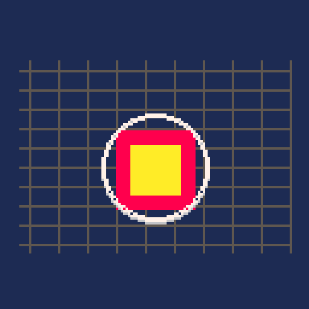

# Screen shake and distortion

`screen_fx` adds short camera shake, a solid color flash, and a bounded expanding shockwave. It is designed for hit feedback, explosions, and other brief impacts. LÖVE can displace the captured scene around the newest active shockwave with a shader. PICO-8, Picotron, and TIC-80 draw a low-cost expanding ring cue because their portable drawing APIs do not expose framebuffer sampling.



## Support and status

| Engine | Module | Integration | Runtime status |
| --- | --- | --- | --- |
| PICO-8 | `src/pico8/screen_fx.lua` | `#include` | Native profile cart measures typical rendering; user confirms visual/performance checks are complete; detailed new measurements are not yet recorded |
| Picotron | `src/picotron/screen_fx.lua` | `include()` | User confirms visual checks are complete; headless runtime smoke and five-run benchmark cover all profiles and wave-pool loads. See the [Picotron report](../../benchmarks/results/picotron-effects.md) |
| LÖVE | `src/love2d/screen_fx.lua` | `require()` | Canvas shader ripple and five-run all-effects benchmark verified on LÖVE 11.5; see the [LÖVE report](../../benchmarks/results/love2d-effects-latest.md) |
| TIC-80 | `src/tic80/screen_fx.lua` | build-time include | Ring cue and scroll-register shake; user confirms visual checks and performance measurements are complete; detailed results are not yet recorded |

The module implements trauma shake, directional impulse, color flash, and bounded shockwaves. On LÖVE, it captures the scene into a reusable canvas and applies one shader pass while a shockwave is active. This samples nearby pixels around the newest wave. It uses `love.graphics.newCanvas` and `love.graphics.newShader`; if those resources cannot be created, rendering falls back to the ring cue. The shader path needs a single render target and temporarily captures the scene, so it costs more than the primitive-only console path. For indexed scenes, use `palette_fx:set_invert_palette()` and `palette_fx:invert()` to apply a temporary negative to draw calls routed through `map_color()`; this avoids mutating global palette or framebuffer state. Typical-load PICO-8 CPU samples are linked in the [profile report](../../benchmarks/results/pico8-profile-smoke.md); the five-run Picotron and LÖVE comparisons are in their [Picotron](../../benchmarks/results/picotron-effects.md) and [LÖVE](../../benchmarks/results/love2d-effects-latest.md) reports. The user confirms PICO-8/TIC-80 visual and performance checks are complete; exact new values are not yet in the reports. Low and high profiles currently affect the demo's effect capacity; console hard limits are 4 on PICO-8 and 32 on Picotron/TIC-80; LÖVE permits up to 64 waves.

## Integration

Copy the engine module to `vfx8/screen_fx.lua` and include it once. Create the effect object and update it once per simulation tick. For a game that uses the camera origin, wrap its scene draw call with `render(draw_scene)`. The callback must draw the scene exactly once.

```lua
-- PICO-8 / Picotron / TIC-80 after including the engine module
local impact_fx = vfx8_screen_fx.new({width = 128, height = 128})

function on_hit(x, y)
  impact_fx:add_trauma(0.8, {intensity = 9, decay = 2.5, frequency = 48, envelope = "trapezoid"})
  impact_fx:impulse(4, 1, 0.18, {randomness = 0.35, direction_x = 2, envelope = "smooth"})
  impact_fx:flash(0.07, 7, {intensity = 1, mode = "color"})
  impact_fx:shockwave(x, y, 2, 10, 0.3, {max_radius = 42, thickness = 2, falloff = 1.2})
end

function update_game(dt)
  impact_fx:update(dt)
end

function draw_game()
  impact_fx:render(draw_scene)
end
```

The calls above fit into the game's existing hit callback and update/draw lifecycle: trigger the functions from the game event, update the effect once alongside the game simulation, and render the scene through its callback. The legacy positional forms remain valid. Alternatively, set `shake_intensity`, `shake_decay`, `shake_frequency`, and `shake_randomness` in `new()` as project defaults, then override selected values per impact.

For LÖVE, use `require("vfx8.screen_fx")` and the same object API. Its `render` method uses a graphics push/translate/pop around the callback and restores the prior draw color after overlays. Set `ripple = false` to disable framebuffer capture, or tune `ripple_strength` and `ripple_width` in pixel units. The defaults are 4 and 8 respectively.

## API

```lua
local fx = vfx8_screen_fx.new({width = 240, height = 136, capacity = 8, seed = 1,
  shake_intensity = 8, shake_decay = 2.5, shake_frequency = 60, shake_randomness = 1})
fx:add_trauma(amount, {intensity, decay, frequency, randomness, envelope})
fx:impulse(offset_x, offset_y, duration, {direction_x, direction_y, intensity, decay, frequency, randomness, envelope})
fx:flash(duration, color, {intensity, mode})
fx:shockwave(x, y, start_radius, strength, duration,
  {center_x, center_y, max_radius, speed, thickness, falloff}) -- false when wave pool is full
fx:update(dt)                                  -- seconds, clamped to 0..0.1
local dx, dy = fx:get_shake_offset()             -- cached offset from the last update
fx:draw_overlays()                              -- draw flash and rings only
fx:render(draw_scene)                          -- draws the scene once, then overlays
fx:clear()                                     -- clears active effects
```

Trauma decays at 2.5 units per second by default and shake amplitude follows squared trauma. `frequency` sets the noise sampling rate; `envelope` accepts `linear`, `smooth`, or `trapezoid`. `direction_x` and `direction_y` are pixel offsets added to the impulse; `randomness` scales the random component. `get_shake_offset()` returns the cached offset until the next update. `flash.mode = "invert"` is implemented as a shader/palette operation only by the host application's palette pipeline; this module falls back to its color flash on all engines. Console flash intensity is binary (zero disables it; any positive value draws the selected palette color) because indexed renderers cannot alpha blend without rewriting the palette. On LÖVE it controls alpha. Waves expand from `start_radius` to `max_radius`, or use `speed * duration` when `max_radius` is omitted; `falloff` controls the expansion curve. `thickness` draws concentric outlines. Shockwave `center_x` and `center_y` override the positional center. On consoles, `speed` is quantized by frame updates, and the wave is a ring cue rather than framebuffer displacement.

## Rendering differences and limits

The scene callback is drawn with a temporary offset on PICO-8 and TIC-80. PICO-8 reads the active camera offsets from draw-state memory (`0x5f28` and `0x5f2a`), adds shake for the callback, uses a zero camera for screen-space flash and ring overlays, then restores the original camera. TIC-80 has no `camera()` function, so its wrapper composes shake with screen-scroll registers `0x3ff9` and `0x3ffa`, restores both registers after the scene callback, and then draws overlays in screen space. Picotron does not expose a portable camera getter, so its wrapper assumes a camera origin; games with a moving camera on Picotron should apply shake in their own camera system instead. LÖVE composes shake as a temporary transform and preserves the caller's transform stack.

When integrating with a game-owned camera, `get_shake_offset()` returns the cached offset for the current update. This path works on every engine and avoids relying on camera getters. Draw `draw_overlays()` afterward to show the flash and rings without drawing the scene a second time:

```lua
local base_x, base_y = camera_x, camera_y
local shake_x, shake_y = impact_fx:get_shake_offset()
camera(base_x + shake_x, base_y + shake_y)
draw_game_scene()
camera(base_x, base_y)
impact_fx:draw_overlays()
```

This avoids relying on a camera getter and preserves the camera position owned by the game.

In LÖVE, apply the returned offset as a temporary transform instead of calling `camera()`:

```lua
local shake_x, shake_y = impact_fx:get_shake_offset()
love.graphics.push()
love.graphics.translate(shake_x, shake_y)
draw_game_scene()
love.graphics.pop()
impact_fx:draw_overlays()
```

Console flashes are solid palette-color overlays; they do not alpha blend or invert the palette. Console shockwaves are expanding ring cues rather than framebuffer displacement. LÖVE requires a single active canvas target for the shader path; rendering to multiple canvases or lacking canvas/shader support uses the geometric fallback. Overlay effects are drawn before the game's UI when the caller draws UI after `render()`.

LÖVE also accepts `viewport = {x, y, width, height}` in `new()` and clips the effect render to that rectangle while restoring the previous scissor rectangle. The fantasy consoles always target the full cartridge display; apply a game-owned clip around `draw_scene` where the engine offers one. Console `capacity` is capped at 4 on PICO-8 and 32 on Picotron/TIC-80; LÖVE is capped at 64.

The implementation bounds ring storage and update/draw work by `capacity`; shake and flash add constant work. Picotron records runtime CPU and heap deltas; LÖVE records Lua update/draw time, heap deltas, and the canvas texture allocation. The user confirms additional PICO-8 and TIC-80 visual/performance checks are complete; raw values are not yet in the reports. See the [Picotron](../../benchmarks/results/picotron-effects.md), [LÖVE](../../benchmarks/results/love2d-effects-latest.md), and [PICO-8](../../benchmarks/results/pico8-profile-smoke.md) reports.
